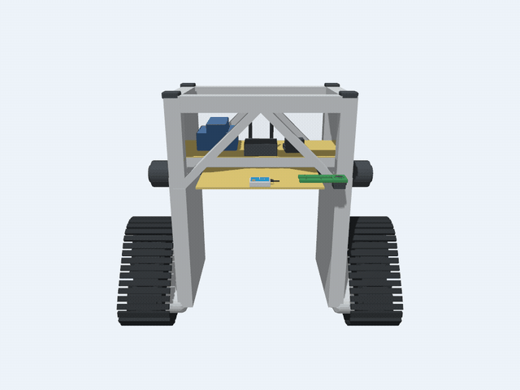
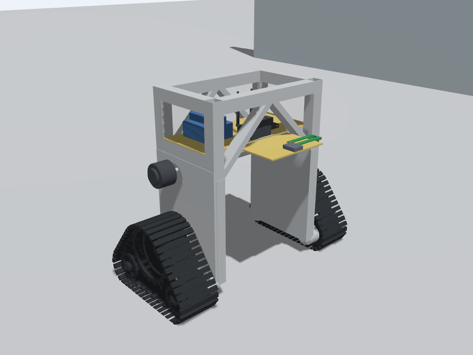
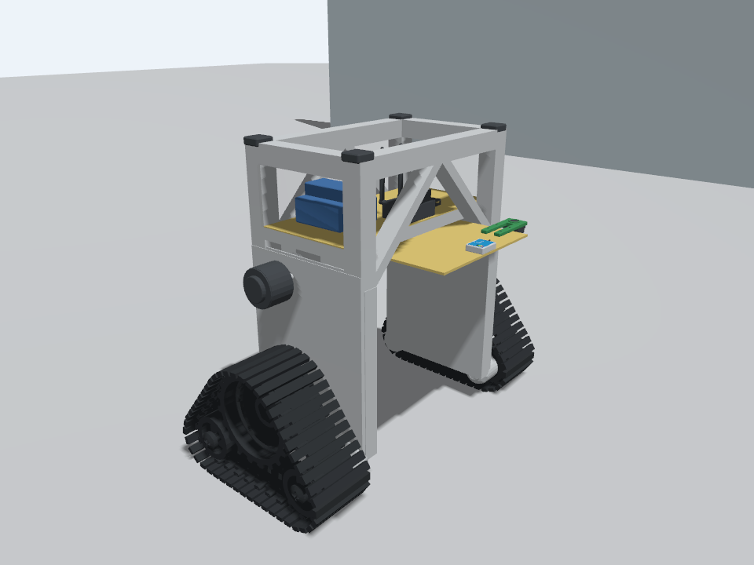
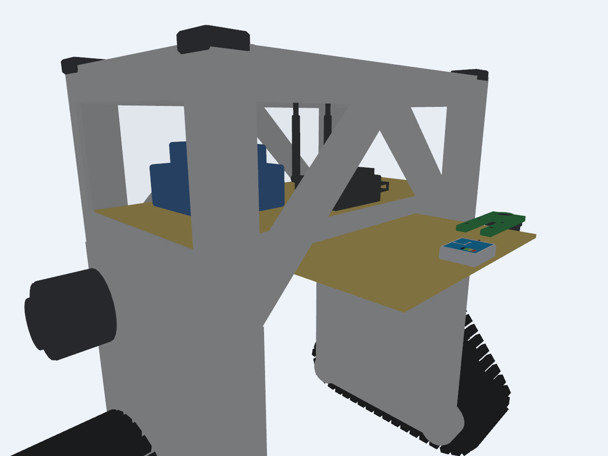
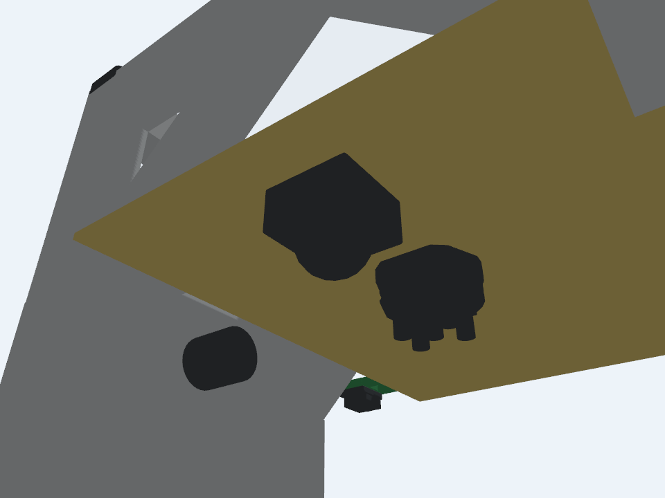
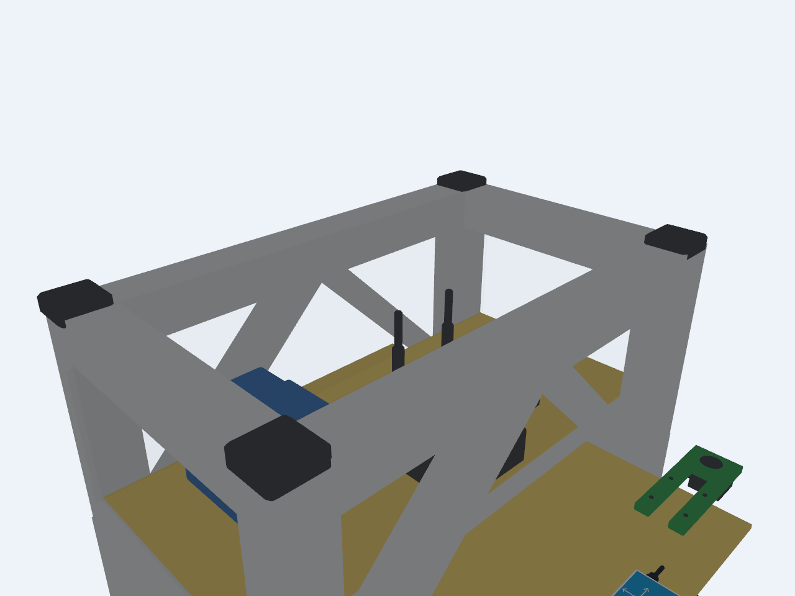
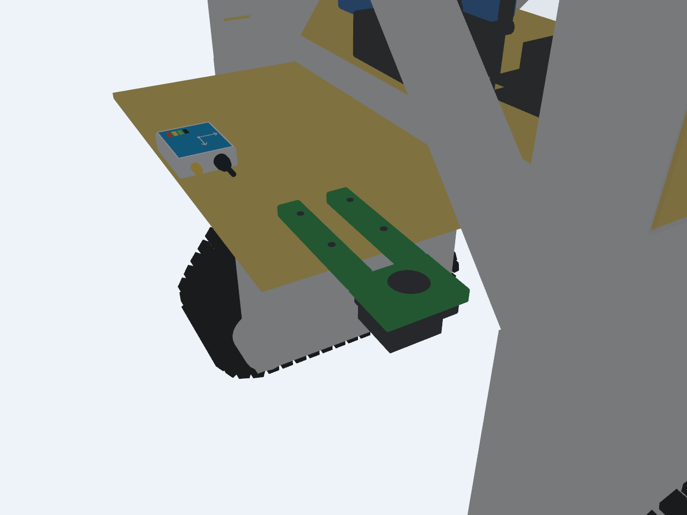

# AgroScouter · симуляция гусеничного робота

Модель робота для **Ubuntu 24.04 · ROS 2 Jazzy · Gazebo Harmonic**. Репозиторий содержит исходный [CAD-файл в формате STEP](cad/robot_model_stp.STEP), подготовленные сетки, SDF-модель, тестовый мир и скрипты для запуска симуляции и телеуправления.

Текущая симуляция воспроизводит движение двух гусениц, визуальную анимацию траков и изображение камеры, направленной вниз с жёлтой площадки, сканы лидара под ней и данные IMU на переднем краю площадки. Корпус IMU детализирован по фотографии: светлый корпус, синяя крышка, разметка осей, кабель и разъём. Корпус нижней камеры повторяет верхнюю CAD-камеру из STEP. Верхняя рама открыта, без панели и антенно-камерного блока. Лидар и выделенная на CAD-снимке центральная круглая камера взяты из исходной STEP-сборки. Лидар перенесён к задней перекладине, а длинная нижняя жёлтая пластина расположена близко под поднятыми перекладинами и выступает вперёд. Отдельная верхняя CAD-площадка с аккумулятором лежит на перекладинах. На нижней стоят IMU и плоское зелёное крепление камеры с круговым ободком и крепёжными отверстиями. По бокам на высоте лидара оставлены небольшие цилиндры по фотографиям. Верхние углы рамы закрыты чёрными скруглёнными накладками. Боковые камеры из STEP, остальная часть манипулятора и мелкие внутренние детали убраны из отображаемой модели. Массы, трение и параметры привода заданы предварительно и требуют проверки на реальном роботе.

## Обзор модели в Gazebo



Анимация снята камерой в Gazebo Harmonic: сначала полный круг вокруг робота, затем обзор снизу и крупные планы лидара, центральной камеры, крепления передней камеры, IMU и гусеницы. Положение модели и цвета соответствуют текущему `models/robot/model.sdf`. Ниже оставлены неподвижные кадры для подробного просмотра деталей.

| Версия 2: до доработки нижней части | Версия 3: текущая модель |
|:---:|:---:|
|  |  |










## Быстрый запуск

Нужны установленные ROS 2 Jazzy и Gazebo Harmonic. Для ROS-моста и сборки плагина:

```bash
sudo apt update
sudo apt install ros-jazzy-ros-gz cmake g++
```

Из корня репозитория запустите симулятор:

```bash
bash start_sim.sh
```

Во втором терминале, тоже из корня репозитория, запустите управление:

```bash
bash teleop.sh
```

Управление: `i` — вперёд, `,` — назад, `j`/`l` — поворот, `k` или пробел — остановка. Команды и раскладка клавиатуры подробно описаны в [руководстве по запуску](docs/getting-started.md).

Для проверки движения, камеры, лидара и IMU во время работы симулятора:

```bash
bash check_motion.sh
```

## Документация

| Раздел | Содержание |
|---|---|
| [Запуск и проверка](docs/getting-started.md) | Режимы запуска, управление, тест движения, решение частых проблем |
| [CAD и модель робота](docs/robot-model.md) | Происхождение геометрии, размеры, система координат, физические допущения |
| [Параметры и ROS-интерфейс](docs/ros-and-configuration.md) | Настройка модели, топики, TF, одометрия, камера, лидар и IMU |

## Состав репозитория

| Путь | Назначение |
|---|---|
| [`cad/robot_model_stp.STEP`](cad/robot_model_stp.STEP) | Исходная CAD-сборка |
| [`models/robot/`](models/robot/) | SDF-модель и сетки STL для Gazebo |
| [`robot_visual_edit.blend`](robot_visual_edit.blend) | Единственная Blender-модель всего робота, включая площадки, камеры, лидар и IMU |
| [`worlds/`](worlds/) | Тестовая сцена |
| [`config/`](config/) | Геометрия, параметры и настройки ROS-моста |
| [`launch/`](launch/) | Запуск симулятора и ROS-узлов |
| [`tools/`](tools/) | Генерация модели, проверка и управление |
| [`images/`](images/) | Фотографии робота, кадры и круговая анимация из Gazebo |

Сборка плагина создаётся при первом запуске в `build/`. Сохранённые версии проекта доступны по тегам **`v1`**, **`v2`** и **`v3`**. Тег `v3` фиксирует текущую модель с нижней пластиной, CAD-лидаром и центральной камерой, IMU, защитными накладками и обзором из Gazebo. Архивы хранятся локально в `backups/` и исключены из Git. Тег `v2` и архив `backups/robot_sim_v2_2026-10-05.tar.gz` фиксируют предыдущее состояние.

## Проверка файлов модели

Проверить структуру SDF, наличие сеток и физические параметры можно без запуска ROS и Gazebo:

```bash
python3 tools/validate_assets.py
```

Проверка работы привода, камеры, лидара и IMU выполняется отдельно командой `bash check_motion.sh` при запущенной симуляции.
