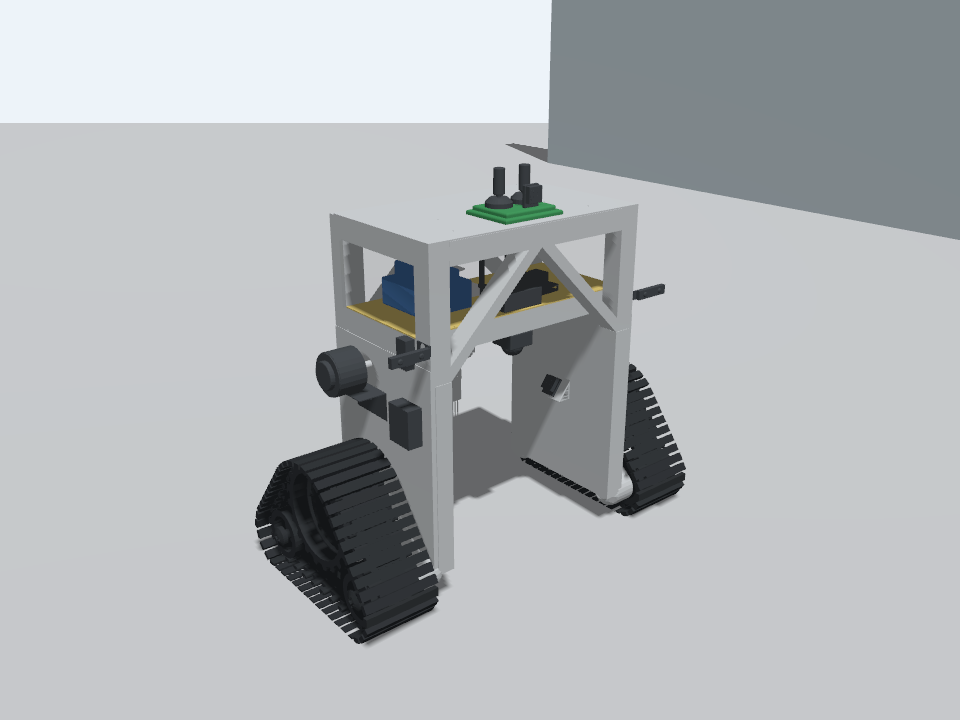

# AgroScouter · симуляция гусеничного робота

Модель робота для **Ubuntu 24.04 · ROS 2 Jazzy · Gazebo Harmonic**. Репозиторий содержит исходный [CAD-файл в формате STEP](cad/robot_model_stp.STEP), подготовленные сетки, SDF-модель, тестовый мир и скрипты для запуска симуляции и телеуправления.



Текущая симуляция воспроизводит движение двух гусениц, визуальную анимацию траков и изображение верхней виртуальной камеры. Манипулятор зафиксирован в положении исходной CAD-сборки. Массы, трение и параметры привода заданы предварительно и требуют проверки на реальном роботе.

## Быстрый запуск

Нужны установленные ROS 2 Jazzy и Gazebo Harmonic. Для ROS-моста и сборки плагина:

```bash
sudo apt update
sudo apt install ros-jazzy-ros-gz cmake g++
```

Из корня репозитория запустите симулятор:

```bash
bash start_sim.sh
```

Во втором терминале, тоже из корня репозитория, запустите управление:

```bash
bash teleop.sh
```

Управление: `i` — вперёд, `,` — назад, `j`/`l` — поворот, `k` или пробел — остановка. Команды и раскладка клавиатуры подробно описаны в [руководстве по запуску](docs/getting-started.md).

Для проверки движения и камеры во время работы симулятора:

```bash
bash check_motion.sh
```

## Документация

| Раздел | Содержание |
|---|---|
| [Запуск и проверка](docs/getting-started.md) | Режимы запуска, управление, тест движения, решение частых проблем |
| [CAD и модель робота](docs/robot-model.md) | Происхождение геометрии, размеры, система координат, физические допущения |
| [Параметры и ROS-интерфейс](docs/ros-and-configuration.md) | Настройка модели, топики, TF, одометрия и камера |

## Состав репозитория

| Путь | Назначение |
|---|---|
| [`cad/robot_model_stp.STEP`](cad/robot_model_stp.STEP) | Исходная CAD-сборка |
| [`models/robot/`](models/robot/) | SDF-модель и сетки STL для Gazebo |
| [`worlds/`](worlds/) | Тестовая сцена |
| [`config/`](config/) | Геометрия, параметры и настройки ROS-моста |
| [`launch/`](launch/) | Запуск симулятора и ROS-узлов |
| [`tools/`](tools/) | Генерация модели, проверка и управление |
| [`images/`](images/) | Фотографии, использованные для подбора цветов |

Сборка плагина создаётся при первом запуске в `build/`. Сохранённая первая версия проекта доступна по тегу **`v1`**. Архивная копия хранится локально в `backups/` и исключена из Git.

## Проверка файлов модели

Проверить структуру SDF, наличие сеток и физические параметры можно без запуска ROS и Gazebo:

```bash
python3 tools/validate_assets.py
```

Проверка работы привода и камеры выполняется отдельно командой `bash check_motion.sh` при запущенной симуляции.
